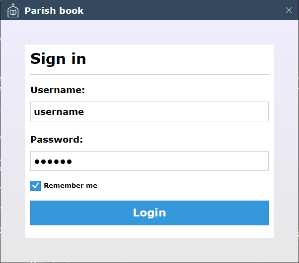
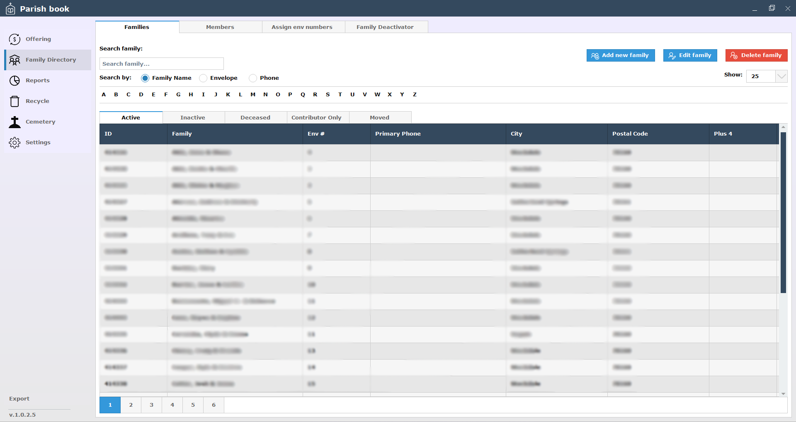
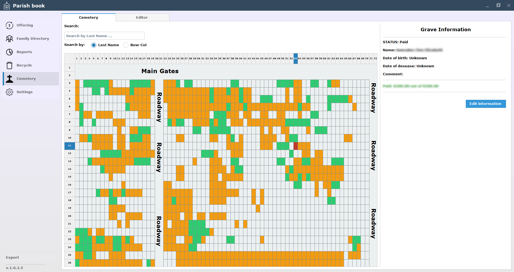
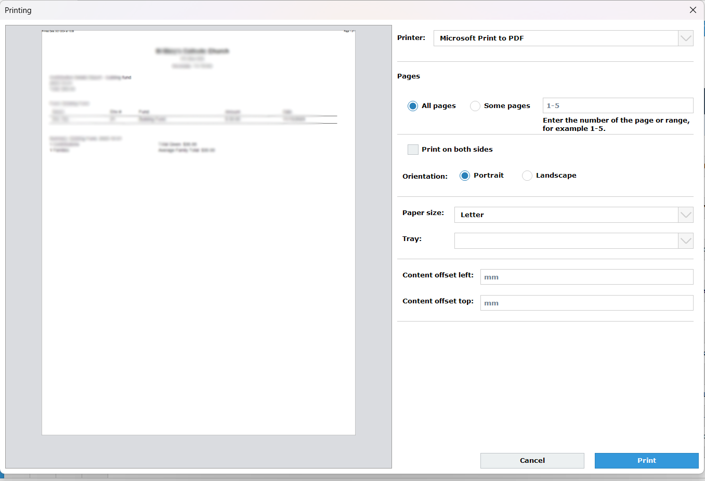

<h1>ParishBook program description</h1>

This program is designed to manage parishioner and collection data for churches. In this repository, I have posted a partial source code of this program, in particular the client portion. This program also has a server portion that was written for Linux OS using the boost ASIO library, but I will not publish the server part of this program in this repository due to security reasons for my clients' data.

<strong>Below are some screenshots that show what this program looks like.</strong>

<h3>Login window</h3>

This program has an authorization window that eliminates the possibility of unauthorized access to church data. The user has only 4 attempts to enter the correct password. If they entered the wrong password 4 times, then this account will be blocked, and the user will have to contact the administrator to unlock their account.

</img>

<h3>Members/Families window</h3>

The Members/Families window is shown below. Here the user can add/change/delete parishioners, view their donation history, and add/change/delete their donations. The user can also make reports on parishioners, such as a report on birthdays, or wedding anniversaries

</img>

<h3>Interactive cemetery window</h3>

This is the window which shows an interactive layout of the church cemetery. The user can change the layout, and add some notes to the layout. Each square marks a grave and the user can easily tell who is buried where and how many more vacant places the cemetery has.

</img>

<h3>Printing dialog</h3>

This is the print dialog in this program. Before printing anything, the user will see a preview of the page they are printing. The print dialog has all the standard printing functions as any other program, such as printer selection and page size selection.

</img>
